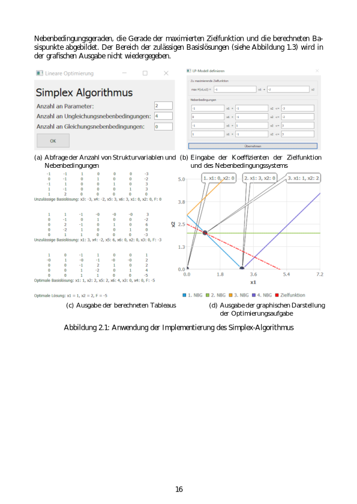
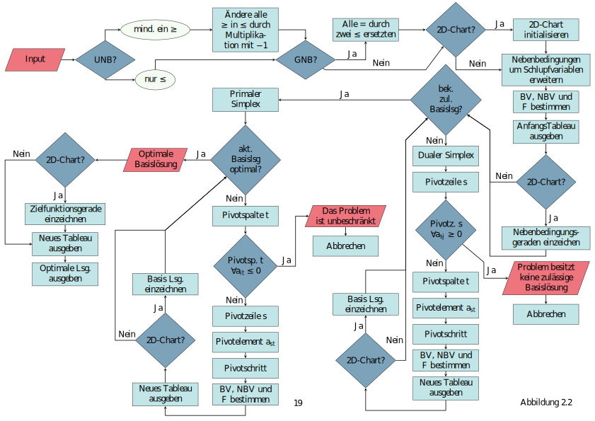
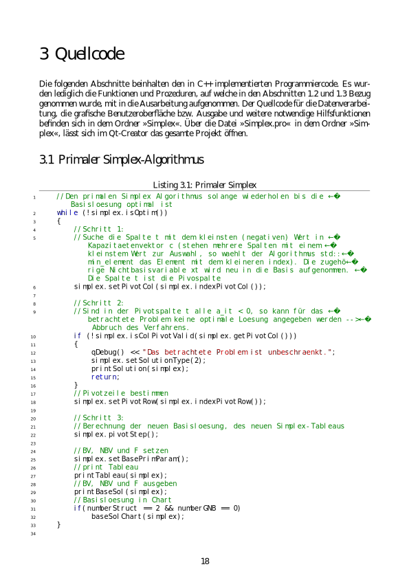
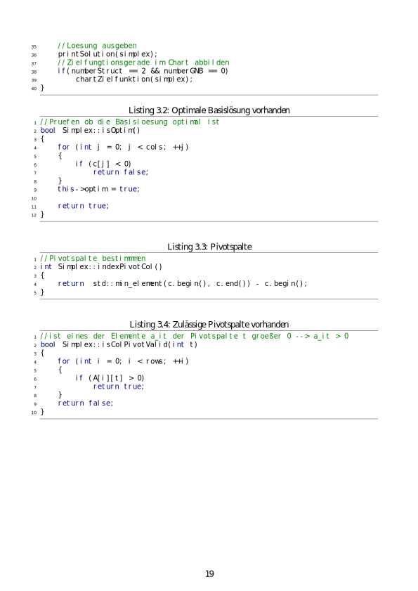
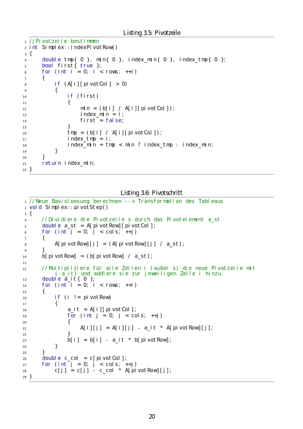
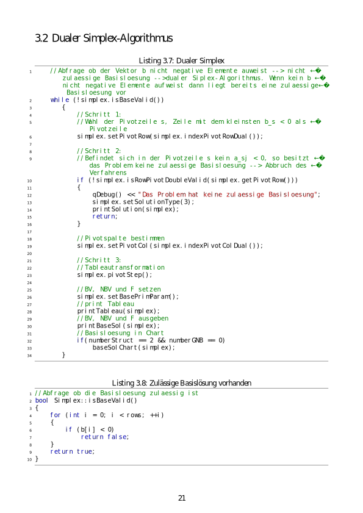
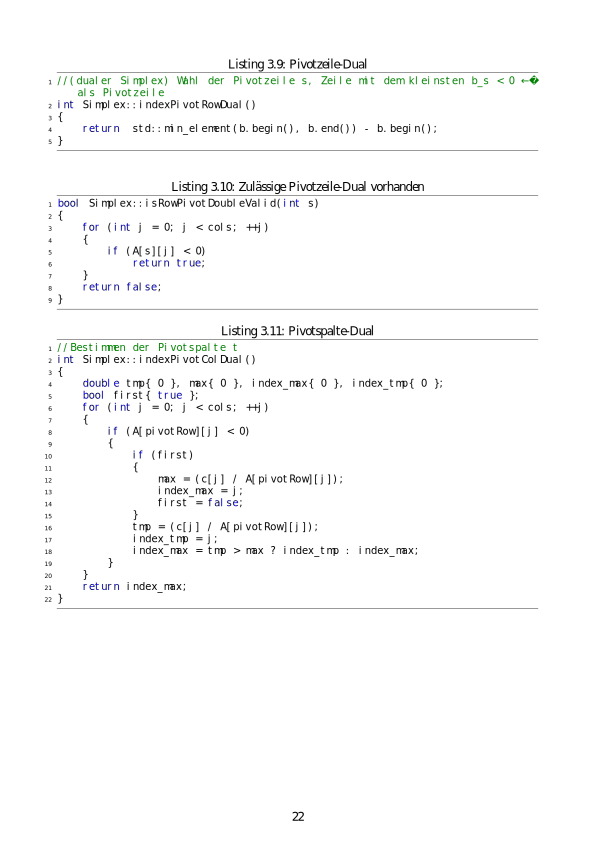

# SimplexCppGUI
Short intro into the simplex algorithm for linear optimization problems (see review_golob.pdf). graphical user interface (GUI) implementation, with visualisation of the simplex steps for 2-D problems. I used Qt to create the GUI. The code is written in C++.

